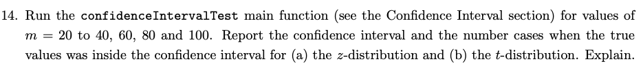
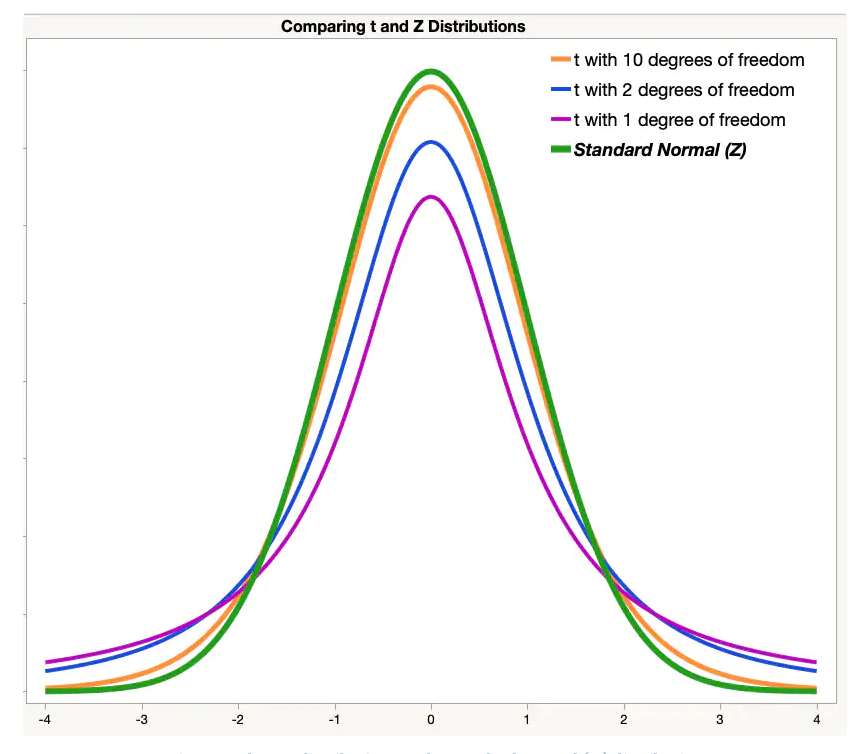

# HW3 Chapter 3.13 Exercise 14

## Z-Distribution (Normal or Gaussian Distribution)

* Number of standard deviation the sample mean is away from the mean of the population
* "Okay" to use if your sample size is greater than 30
* Basically if sample size is over 30 distribution is close enough to normal we will use the normal distribution to approximate

## T-Distribution

* Distribution that is similar to the normal distribution for situations in which sample size is small. 
* Typically used when sample size <= 30
* As degrees of freedom increase (sample size - 1) the t-distribution approaches the normal distribution.  

## t vs Z Distribution

## Explanation

As we can see from the graph in excel for the number of cases, the number of cases in the confidence interval (CI) is always greater for the t-dist vs the z-dist. This is because the the t-dist has less area under the center than the z-dist and more area in the tails. This translates into the confidence interval being larger for the t-dist rather than the z-dist. If the confidence interval is larger than number of cases it contains will also be higher. 

Also, we can see that for very small sample sizes the diffenece is very great, but as sample size increases the number of cases in the CI for both distributions starts to come together.

Now, lets take a look at the visual in Tableau. It shows the difference of the CIs (end - start) created for both the t and Z distribution when random sampling happens 100 times. In other words, we have the magnitude of 100 randomly created confidence intervals created at a certain sample size. 

What this visual allows us to see is the fact that when sample size in the confidence intervals for both distributions is small there is a large amount of variation and the average length of the confidence interval is great, but as sample size increases the variation decreases and the average length of the confidence interval decreases. In other words, as sample size increase we can be more confident with a smaller confidence interval. 

